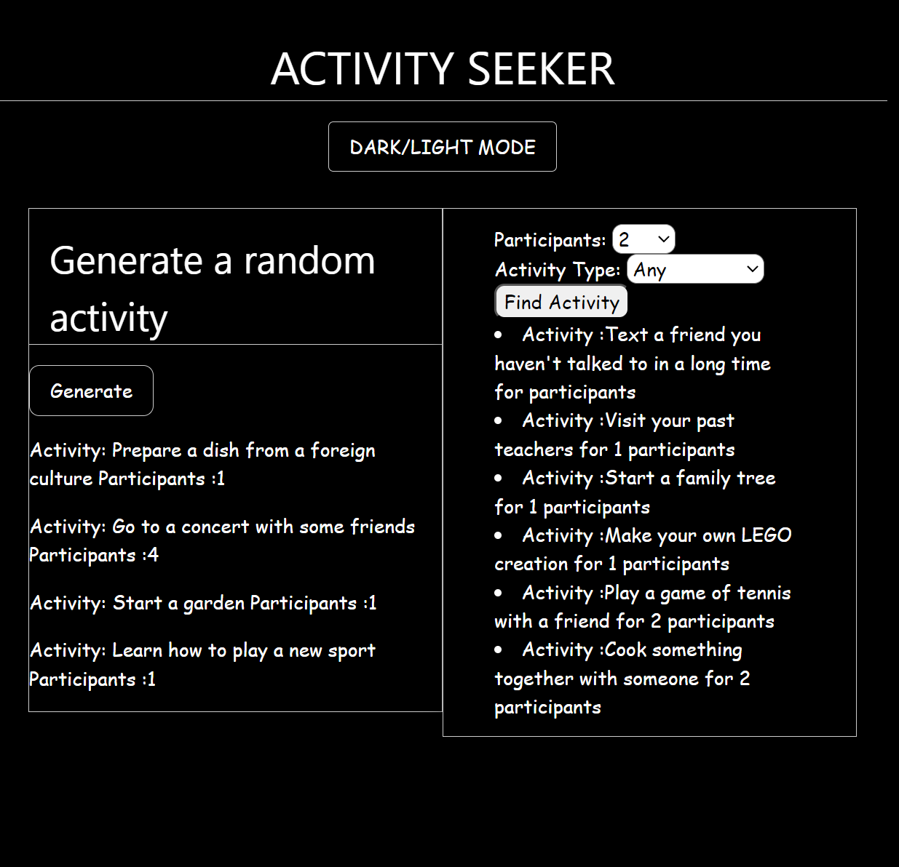

# ACTIVITY-SEEKER

A brief description of what the project does -
This project suggest activities to the user to do . I t also has a filter functionality if you want to be specific with the number of participants . 
The project uses BORED API to suggest activites to the user by using fetch to communicate with the api

## Table of Contents

- [Installation](#installation)
- [Usage](#usage)
- [Contributing](#contributing)
- [License](#license)

## Installation

Instructions on how to install the project and its dependencies.
 For installation you can clone the repo ar zip . 
 After cloning you can run the html file to run the app 

## Usage

Instructions on how to use the project, including examples.
To use the activity-seeker, you can press on the generate button for it to give you a random activity to do , or use the filter search in the right if you already have a type of activity and number of participants 

## Contributing

Guidelines for contributing to the project, including how to report bugs and suggest improvements.
For contribution please contact me :

## License

Information about the project's license, and any additional terms and conditions.
Refer to license document . GPL-3.0 LICENSE 
